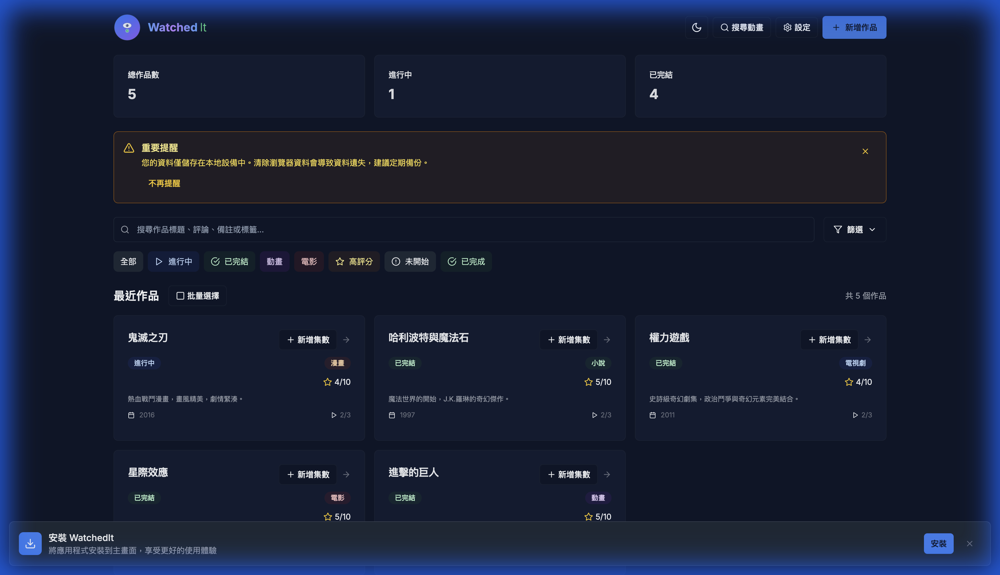
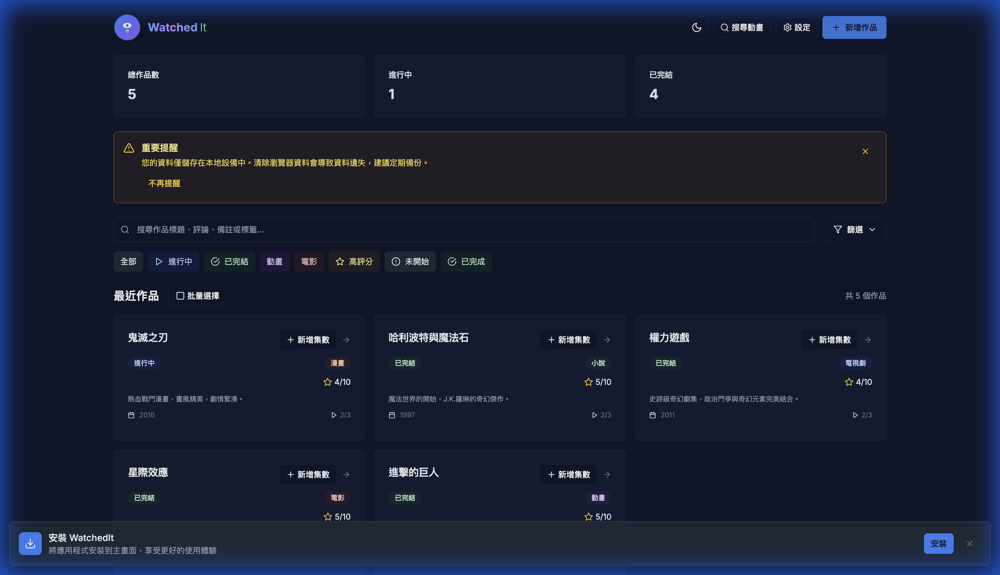
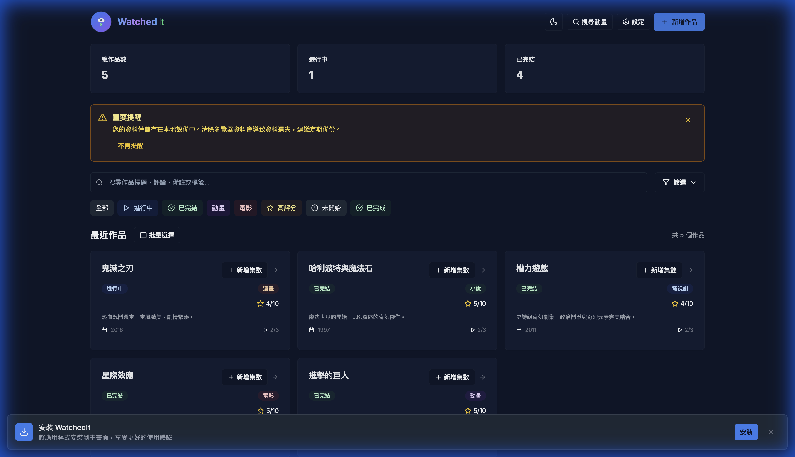
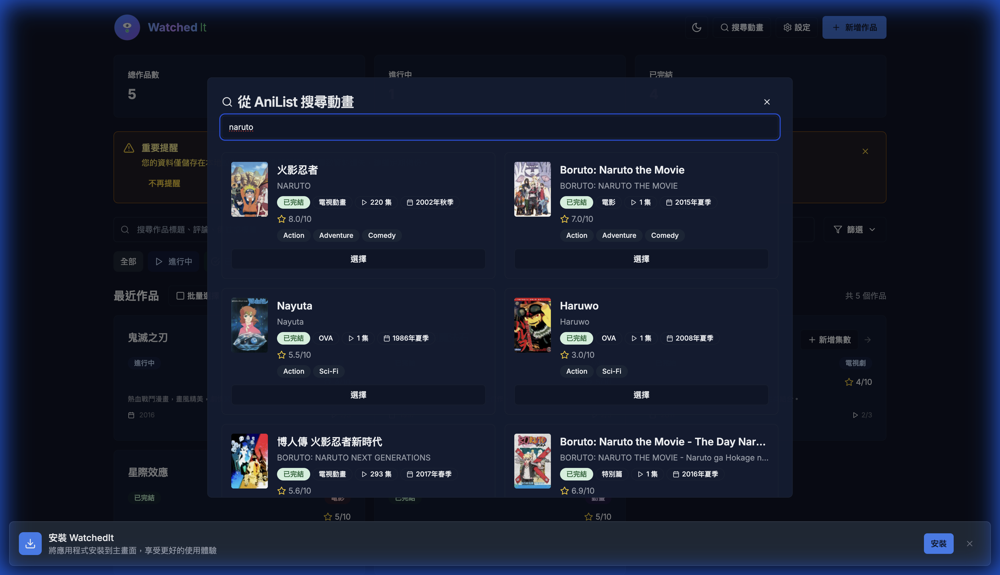
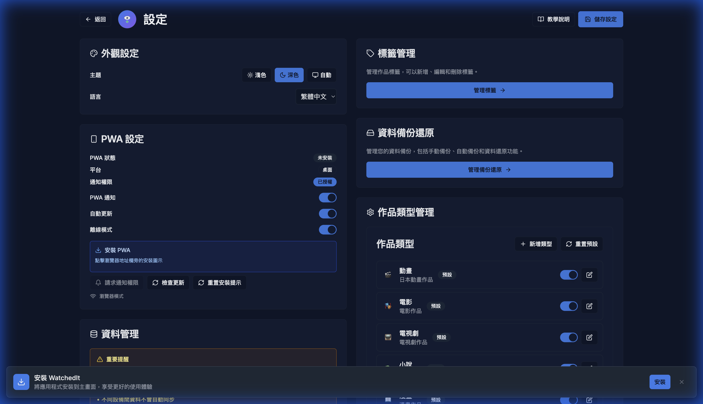

# WatchedIt

> A modern, local-first media tracking application for anime, movies, TV series, novels, manga, and games.



## ✨ Features

### 📱 Progressive Web App (PWA)
- **Installable**: Add to home screen on mobile and desktop
- **Offline Support**: Works without internet connection
- **Fast & Responsive**: Native app-like experience

### 🎬 Media Tracking
- Track multiple media types: Anime, Movies, TV Series, Novels, Manga, Games
- Episode/Chapter management with custom types
- Progress tracking and completion rates
- Rating and review system
- Custom tags and categorization

### 🔍 AniList Integration
- Search and import anime directly from AniList
- Automatic metadata fetching
- Seamless integration with your tracking workflow

### 💾 Local-First Architecture
- **IndexedDB Storage**: All data stored locally in your browser
- **No Account Required**: Start tracking immediately
- **Privacy First**: Your data never leaves your device
- **Data Migration**: Automatic migration from localStorage to IndexedDB
- **Backup & Restore**: Export and import your data anytime

### 🎨 Modern UI/UX
- **Dark Mode**: Full dark mode support with system preference detection
- **Responsive Design**: Optimized for mobile, tablet, and desktop
- **Smooth Animations**: Polished transitions and micro-interactions
- **Accessible**: Built with accessibility in mind

### 🔧 Advanced Features
- **Batch Operations**: Edit or delete multiple works at once
- **Advanced Filtering**: Filter by type, status, year, tags, rating, and progress
- **Search**: Full-text search across titles, reviews, and notes
- **Reminders**: Set reminders for ongoing series
- **Statistics**: Visual insights into your watching habits

## 🚀 Tech Stack

### Frontend
- **Framework**: [Next.js 14](https://nextjs.org/) (App Router)
- **Language**: TypeScript
- **Styling**: Tailwind CSS
- **UI Components**: [shadcn/ui](https://ui.shadcn.com/)
- **State Management**: [Zustand](https://github.com/pmndrs/zustand)
- **Icons**: [Lucide React](https://lucide.dev/)
- **i18n**: [next-intl](https://next-intl-docs.vercel.app/)

### Backend
- **Framework**: [FastAPI](https://fastapi.tiangolo.com/) (Python)
- **Database**: SQLite
- **ORM**: SQLAlchemy

### Storage
- **Primary**: IndexedDB (via Dexie.js)
- **Legacy**: LocalStorage (with automatic migration)

## 📸 Screenshots

### Light Mode


### Dark Mode


### AniList Search


### Settings


## 🛠️ Getting Started

### Prerequisites
- Node.js 18+ (for frontend)
- Python 3.8+ (for backend, optional)

### Installation

#### Frontend Only (Recommended for most users)
```bash
# Clone the repository
git clone https://github.com/guan4tou2/WatchedIt.git
cd WatchedIt/frontend

# Install dependencies
npm install

# Run development server
npm run dev

# Open http://localhost:3000
```

#### With Backend (Optional)
```bash
# Terminal 1: Backend
cd backend
python -m venv venv
source venv/bin/activate  # On Windows: venv\Scripts\activate
pip install -r requirements.txt
uvicorn app.main:app --reload

# Terminal 2: Frontend
cd frontend
npm install
npm run dev
```

### 🧪 Testing

#### Unit Tests
Run unit tests using Jest:
```bash
cd frontend
npm test
```

#### End-to-End (E2E) Tests
Run E2E tests using Playwright:
```bash
cd frontend
npx playwright test
```

### Building for Production
```bash
cd frontend
npm run build
npm start
```

## 📦 Deployment

### Vercel (Recommended)
[](https://vercel.com/new/clone?repository-url=https://github.com/guan4tou2/WatchedIt)

### Docker
```bash
# Frontend
cd frontend
docker build -t watchedit-frontend .
docker run -p 3000:3000 watchedit-frontend

# Backend
cd backend
docker build -t watchedit-backend .
docker run -p 8000:8000 watchedit-backend
```

## 🌐 Internationalization

WatchedIt supports multiple languages:
- English (en)
- Traditional Chinese (zh-TW)

Language can be switched using the globe icon in the header.

## 🤝 Contributing

Contributions are welcome! Please feel free to submit a Pull Request.

1. Fork the repository
2. Create your feature branch (`git checkout -b feature/AmazingFeature`)
3. Commit your changes (`git commit -m 'Add some AmazingFeature'`)
4. Push to the branch (`git push origin feature/AmazingFeature`)
5. Open a Pull Request

## 📄 License

This project is open source and available under the [MIT License](LICENSE).

## 🙏 Acknowledgments

- [AniList](https://anilist.co/) for the anime database API
- [shadcn/ui](https://ui.shadcn.com/) for beautiful UI components
- [Lucide](https://lucide.dev/) for icons
- All contributors and users of this project

## 📧 Contact

- GitHub: [@guan4tou2](https://github.com/guan4tou2)
- Project Link: [https://github.com/guan4tou2/WatchedIt](https://github.com/guan4tou2/WatchedIt)

---

Made with ❤️ by the WatchedIt team
